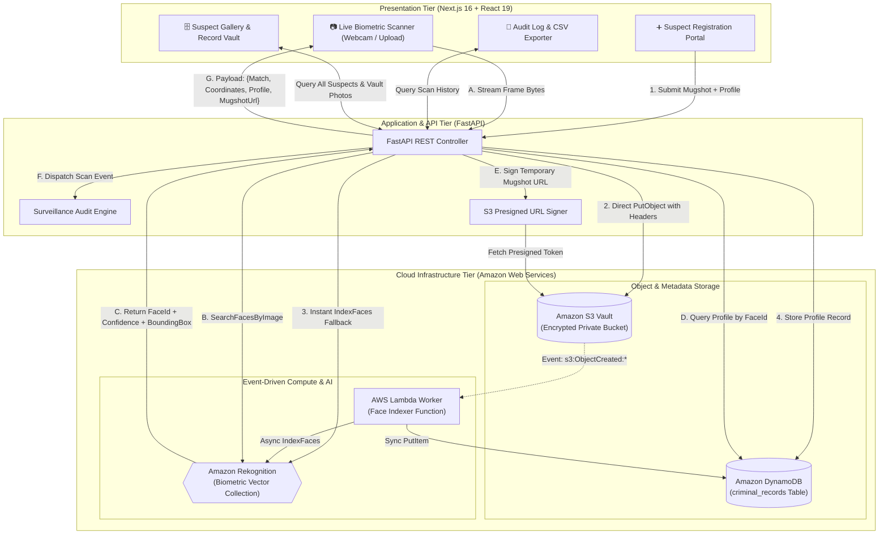

# 🚨 CrimeVision — Intelligent Cloud-Based Criminal Identification System

[](https://nextjs.org/)
[](https://fastapi.tiangolo.com/)
[](https://aws.amazon.com/rekognition/)
[](https://aws.amazon.com/s3/)
[](https://aws.amazon.com/dynamodb/)
[](https://www.docker.com/)

**CrimeVision** is an enterprise-grade biometric surveillance and criminal identification platform built on **Amazon Web Services (AWS)**, **FastAPI**, and **Next.js**. It enables law enforcement and security teams to index suspect records in the cloud, perform real-time biometric scanning via webcam or image upload, visualize facial bounding boxes, and instantly surface criminal profiles with side-by-side mugshot verification.

---

## 🏗️ Detailed System Architecture

CrimeVision is engineered using a decoupled, event-driven cloud architecture that strictly separates **biometric vector computation** from **relational identity metadata**.



---

### 🔄 Architectural Workflows Explained

#### 1. Ingestion & Vectorization Pipeline (Enrollment Phase)
```
[Suspect Mugshot] ──► [FastAPI / S3 Vault] ──► [AWS Lambda] ──► [Amazon Rekognition] ──► [Amazon DynamoDB]
```
1. **Photo Upload**: An investigator enters a suspect's full name, offense category, wanted status, and attaches a front-facing mugshot via the Registration Portal.
2. **Encrypted Storage**: The photo is uploaded to private Amazon S3 storage (`s3://crimevision-mugshots-bucket-unique/criminals/`) with custom metadata tags.
3. **Serverless Event Trigger**: S3 automatically publishes an `s3:ObjectCreated:*` event to AWS Lambda.
4. **Deep-Learning Vector Extraction**: AWS Lambda forwards the image bytes to Amazon Rekognition (`IndexFaces`). Rekognition extracts a 128-dimensional facial feature vector, stores the biometric vector in `criminal_collection`, and returns a unique `FaceId` (e.g. `d71c8282-35a1-...`).
5. **NoSQL Metadata Binding**: Lambda writes the suspect record to Amazon DynamoDB (`criminal_records` table) using `RekognitionId` as the Primary Partition Key (`HASH`).

#### 2. Real-Time Biometric Surveillance Pipeline (Identification Phase)
```
[Live Webcam / Upload] ──► [FastAPI Engine] ──► [Rekognition Search] ──► [DynamoDB Lookup] ──► [Visualizer UI]
```
1. **Frame Capture**: A webcam snapshot or surveillance photograph is captured and dispatched to `/api/recognize`.
2. **Biometric Similarity Search**: FastAPI invokes Amazon Rekognition (`SearchFacesByImage`) with an 80%+ similarity threshold.
3. **Bounding Box Coordinates**: Rekognition computes normalized relative spatial coordinates (`Left`, `Top`, `Width`, `Height`) and returns the matched `FaceId`.
4. **Profile Hydration**: FastAPI performs a millisecond-latency key lookup in Amazon DynamoDB (`table.get_item(Key={'RekognitionId': face_id})`).
5. **Cryptographic S3 Presigning**: FastAPI generates an ephemeral AWS Presigned URL (1-hour validity) for the suspect's original mugshot so the browser can securely display the database photo without making the S3 bucket public.
6. **Canvas Overlay Rendering**: The Next.js frontend renders dynamic bounding boxes, match confidence gauges, and side-by-side verification cards.

---

### 🛡️ Component Roles & Cloud Matrix

| Layer | Component | Cloud Service | Purpose & Responsibility |
| :--- | :--- | :--- | :--- |
| **Presentation** | Next.js 16 / React 19 | Client-Side SPA | Real-time webcam streaming, dynamic canvas bounding boxes, CSV audit downloads. |
| **Application Gateway** | FastAPI / Uvicorn | Python REST Engine | Request validation, biometric coordinate normalization, presigned URL signing. |
| **Biometric Store** | Amazon Rekognition | AWS AI/ML Vector DB | Facial detection, feature extraction, and high-dimensional cosine similarity matching. |
| **Suspect Metadata** | Amazon DynamoDB | AWS Managed NoSQL | Sub-10ms key-value store mapping `RekognitionId` to suspect profiles and criminal history. |
| **Mugshot Vault** | Amazon S3 | AWS Object Storage | Encrypted, versioned cloud storage for high-resolution suspect photos. |
| **Event Processor** | AWS Lambda | AWS Serverless Compute | Event-driven worker that automatically indexes any mugshot uploaded to S3. |

---

## 🌟 Key Features

* **📷 Dual-Mode Biometric Scanner**: Real-time live webcam snapshot capture and high-resolution photo file upload.
* **🎯 Precision Bounding Box Visualizer**: Overlays dynamic bounding boxes and confidence badges directly onto detected faces using normalized Rekognition coordinates.
* **🖼️ Side-by-Side Mugshot Verification**: Instantly matches live surveillance captures against official S3 database mugshots using secure AWS Presigned URLs.
* **⚡ Hybrid Cloud Ingestion Pipeline**:
  - **Serverless Event-Driven**: Automatic background indexing via S3 Object-Created events triggering AWS Lambda.
  - **Direct Indexing Fallback**: Zero-latency biometric indexing directly into Rekognition and DynamoDB on registration.
* **🗄️ Suspect Database Gallery**: Interactive digital mugshot vault querying DynamoDB records and displaying active status badges (`WANTED`, `CLEARED`, `UNDER INVESTIGATION`).
* **📜 Surveillance Audit Logging & CSV Export**: Immutable tracking of every scan event (timestamp, suspect, status, confidence) with one-click official CSV export.
* **🐳 Fully Dockerized**: Production-ready `Dockerfile` and `docker-compose.yml` for unified one-command execution.

---

## 📁 Repository Structure

```
CrimeVision-App/
├── .github/workflows/ci.yml       # GitHub Actions CI/CD Pipeline
├── api/                           # FastAPI Backend
│   ├── lambda_deploy/             # AWS Lambda Handler & Deployment Package
│   │   └── lambda_function.py     # S3 -> Rekognition -> DynamoDB indexer
│   ├── Dockerfile                 # Backend container definition
│   ├── main.py                    # Core REST API (biometrics, S3, audit logs)
│   ├── requirements.txt           # Python dependencies
│   ├── setup_aws.py               # Automated AWS infrastructure provisioning
│   └── .env                       # Cloud credentials & region config
├── frontend/                      # Next.js 16 App Router
│   ├── src/app/
│   │   ├── page.tsx               # Live Biometric Scanner & Bounding Box UI
│   │   ├── register/page.tsx      # Cloud Suspect Enrollment Form
│   │   ├── audit/page.tsx         # Audit Trail & CSV Exporter
│   │   ├── suspects/page.tsx      # Digital Suspect Mugshot Gallery
│   │   └── layout.tsx             # Navigation header & dark theme wrapper
│   ├── Dockerfile                 # Frontend container definition
│   └── package.json               # Next.js & UI dependencies
├── docker-compose.yml             # Full-stack Docker composition
└── README.md                      # Complete Project Documentation
```

---

## ⚡ Quickstart Guide

### Option 1: Run with Docker Compose (Recommended)

Make sure Docker is running on your machine, then run:

```bash
docker compose up --build
```
* **Frontend**: [http://localhost:3000](http://localhost:3000)
* **Backend API Docs**: [http://localhost:8000/docs](http://localhost:8000/docs)

---

### Option 2: Run Locally (Development Mode)

#### 1. Configure Cloud Credentials
Create `api/.env`:
```env
AWS_ACCESS_KEY_ID=your_access_key
AWS_SECRET_ACCESS_KEY=your_secret_key
AWS_REGION=ap-south-1
S3_BUCKET_NAME=crimevision-mugshots-bucket-unique
DYNAMODB_TABLE=criminal_records
REKOGNITION_COLLECTION=criminal_collection
```

#### 2. Provision AWS Infrastructure
```bash
cd api
python setup_aws.py
```

#### 3. Start Backend
```bash
cd api
# Activate virtual environment
.\venv\Scripts\activate
uvicorn main:app --reload --port 8000
```

#### 4. Start Frontend
```bash
cd frontend
npm install
npm run dev
```

---

## 🔌 API Reference

| Method | Endpoint | Description |
| :--- | :--- | :--- |
| `POST` | `/api/recognize` | Analyzes image bytes, detects face, searches Rekognition, returns metadata & presigned mugshot URL |
| `POST` | `/api/register` | Stores mugshot in S3, indexes face vector in Rekognition, and persists profile in DynamoDB |
| `GET` | `/api/suspects` | Retrieves all registered suspect profiles with temporary S3 presigned URLs |
| `GET` | `/api/audit-logs` | Fetches historical scan events for surveillance auditing |
| `DELETE`| `/api/audit-logs` | Clears local audit history |
| `GET` | `/api/health` | Service health status and active AWS region |

---

## 🔒 Security & Biometric Best Practices

1. **Vector & PII Isolation**: Amazon Rekognition stores only numerical facial vector embeddings; personal identifiable information (PII) is isolated in DynamoDB and decrypted only on authorized match.
2. **Ephemeral S3 Presigned URLs**: Biometric mugshots are kept private in S3 with all public access blocked. The frontend receives temporary, cryptographically signed URLs with a 1-hour expiration.
3. **Zero Hardcoded Secrets**: Cloud keys are strictly injected via `.env` and environment variables, guarded by `.gitignore` and `.dockerignore`.
4. **Least-Privilege IAM**: Execution roles and API users are scoped strictly to the `criminal_collection`, `crimevision-mugshots-*` bucket, and `criminal_records` table.
